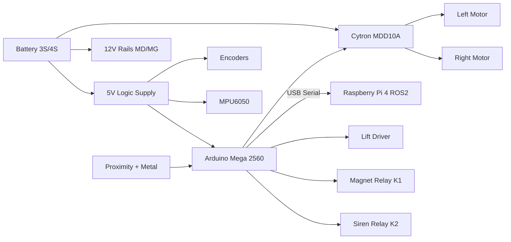

# Minesweeper 2026 — Wiring Manual

**Audience:** Assembly technicians and bring-up engineers  
**Hardware:** `Robotics_Mine` KiCad shield + Magnets/Lift + Metal Detector sections  
**Firmware:** `MotorController` (`Config.h` VERSION 3 — no PCB edits)

---

## 1. System Overview



---

## 2. Power Distribution

| Rail | Source | Consumers | Notes |
|------|--------|-----------|-------|
| **VBAT** | Battery pack | Cytron motor power, 12V_MD, 12V_MG | Fuse at battery positive |
| **12V** (J24) | Battery or regulator | Relays K1/K2 coils, magnet/lift power | Large caps on board |
| **12V_MD** (J46) | 12V for metal/prox sensors | J1–J5 APRXMT brown pins | Sensor excitation |
| **12V_MG** (J43) | Magnets & lift power | MAG1–5, LIFT motor | After bring-up, confirm K1 gating |
| **5V_LOGIC** (J22) | Logic PSU | Mega 5V, encoders, MPU, logic | Bond to Mega 5V |
| **5V_SERVO** (J23) | Separate 5V | Servo only | Isolate from logic noise |
| **GND** | Common | All subsystems | Single-point bond near Mega |

### Critical grounding rules

1. Cytron GND, Mega GND, and sensor GND **must** share a common ground.
2. Do not return motor current through sensor signal grounds alone.
3. Keep motor power wires twisted pairs; keep encoder wires away from motor leads.

### Recommended fusing

| Circuit | Fuse |
|---------|------|
| Battery → Cytron | 20–30 A (match motors) |
| Battery → 12V board rail | 5–10 A |
| 5V_LOGIC supply | 2–3 A |

---

## 3. Arduino Mega Pin Mapping (Technician Table)

| Arduino Pin | Signal | Device | How connected |
|-------------|--------|--------|---------------|
| D18 | ENC_R_B (B2) | Right encoder Phase B | PCB copper |
| D19 | ENC_R_A (A2) | Right encoder Phase A | PCB copper |
| D20 | ENC_L_B (B1) | Left encoder Phase B | PCB copper |
| D21 | ENC_L_A (A1) | Left encoder Phase A | PCB copper |
| D30 | soft SDA | MPU6050 SDA | **Flying lead** (not J29) |
| D31 | soft SCL | MPU6050 SCL | **Flying lead** (not J38) |
| D8 | DIR3 | Lift DIR | Jumper → J37 / J44 |
| D10 | PWM3 | Lift PWM | Jumper → J37 / J44 |
| D27 | MTLDTCT / MD | Metal detector | Jumper → J6.1 or J40.1 |
| D28 | LM1 | Limit switch 1 (top) | Jumper → J43/J44 |
| D29 | LM2 | Limit switch 2 (bottom) | Jumper → J43/J44 |
| D35 | WARN_LED | Warning LED | Discrete LED + 220 Ω to GND |
| D36 | SERVO | Optional servo | PCB copper → J13 |
| D37 | SIREN | Siren relay drive | Jumper → J15.1 |
| D38 | MAGNET | Magnet relay K1 | PCB copper → J14 |
| D40 | DIR2 | Left motor DIR | PCB copper → J36 |
| D42 | DIR1 | Right motor DIR | PCB copper → J36 |
| D44 | PWM1 | Right motor PWM | PCB copper → J36 |
| D46 | PWM2 | Left motor PWM | PCB copper → J36 |
| A0 | BAT_SENSE | Battery monitor | Off-board divider |
| A1–A5 | AP1–AP5 | Proximity | Jumper → J6 |
| D0/D1 | USB Serial | Raspberry Pi | Mega USB |

---

## 4. IMU Harness (No PCB Edit)

**Do not use shield J29/J38 for MPU data.** Those pads collide with ENC1 on D20/D21 through the Mega.

### Flying-lead pinout

| MPU6050 module | Mega pin | Notes |
|----------------|----------|-------|
| VCC | 5V (Mega or J22 logic) | 5V module preferred |
| GND | GND | Common ground |
| SDA | **D30** | Soft I2C (`IMU_USE_SOFT_I2C`) |
| SCL | **D31** | Soft I2C |
| AD0 | GND | Address 0x68 |
| INT | NC | Unused |

Add 4.7 kΩ pull-ups from SDA/SCL to 5V if the module has none.

Leave J29/J38 unpopulated, or use only for mechanical mounting — never tie module SDA/SCL into those headers while ENC1 is connected.

---

## 5. Encoder Wiring (PCB Copper — Unchanged)

### ENC1 — Left (J16)

| J16 | Net | Mega (as fabricated) |
|-----|-----|----------------------|
| 1 | GND | GND |
| 2 | B1 | **D20** |
| 3 | A1 | **D21** |
| 4 | 5V_LOGIC | 5V |

### ENC2 — Right (J17)

| J17 | Net | Mega |
|-----|-----|------|
| 1 | GND | GND |
| 2 | B2 | D18 |
| 3 | A2 | D19 |
| 4 | 5V_LOGIC | 5V |

No cuts. No green-wire on encoder nets. Use twisted pairs when cable > 30 cm.

---

## 6. Motor Driver Wiring — Cytron MDD10A

### Logic header J36 (shield)

| J36 Pin | Signal | Mega |
|---------|--------|------|
| 1 | DIR1 | D42 |
| 2 | PWM1 | D44 |
| 3 | DIR2 | D40 |
| 4 | PWM2 | D46 |
| 5 | GND | GND |

### Cytron power / motors (off-board)

| Cytron terminal | Connection |
|-----------------|------------|
| B+ / B− | Battery (fused) |
| M1A / M1B | Right drive motor |
| M2A / M2B | Left drive motor |
| GND (logic) | Common with Mega |

Sign-magnitude mode: PWM = speed, DIR = direction (HIGH = forward in firmware default).

If a wheel runs backward, prefer EEPROM `invert_*_motor` over swapping wires after polarity is documented.

---

## 7. Lift / Magnets / Limits / Sensors

(See sections below for connectors; control signals use the jumper harness in §3.)

### Lift control jumpers

| Signal | Mega | Board |
|--------|------|-------|
| PWM3 | D10 | J37 / J44 |
| DIR3 | D8 | J37 / J44 |
| LM1 | D28 | J43 / J44 |
| LM2 | D29 | J43 / J44 |

### Electromagnets

Powered from `12V_MG`. Control is **common relay K1** on Mega **D38**.

### Limit switches

Active HIGH when closed to 12 V (divider). Top = LM1/D28, bottom = LM2/D29.

### Proximity / metal

Jumper J6 AP1–AP5 → Mega A1–A5; J6.1 MD → D27.

### Lift motor power

| Connector | Pins | Notes |
|-----------|------|-------|
| J28 LIFT | 12V_MG, GND_MG | Motor leads |
| External H-bridge / Cytron single | PWM3/DIR3 from J20 or harness | Match driver type in field |

### Electromagnets MAG1–MAG5 (J9–J12, J27)

Powered from `12V_MG`. Control is **common relay K1** driven by Mega **D38** (J14 → Q1 → K1 → J19 MAGNET SW).

Verify during bring-up whether `12V_MG` is always live or gated by K1.

### Limit switches (J45 LIMIT1, J35 LIMIT2)

| Switch | Board net | Mega | Polarity |
|--------|-----------|------|----------|
| LIMIT1 | LM1 (via divider) | D28 | Active HIGH when closed to 12V |
| LIMIT2 | LM2 (via divider) | D29 | Active HIGH when closed to 12V |

Map physically: top = LM1 (D28), bottom = LM2 (D29). Swap in firmware only if bench test shows inverted.

---

## 8. Metal Detector / Proximity Section

### Sensor connectors J1–J5 (APRXMT, 4-pin)

| Pin | Color net | Function |
|-----|-----------|----------|
| 1 | WHITE | Sensor-specific |
| 2 | OUT | Signal → divider → APn |
| 3 | BLU | GND_MD |
| 4 | BRWN | 12V_MD |

### Conditioned outputs J6 (`OI54321GV` / `V G 1 2 3 4 5 M I O` family)

| J6 | Net | Mega jumper |
|----|-----|-------------|
| 1 | MD | D27 |
| 2 | AP5 | A5 |
| 3 | AP4 | A4 |
| 4 | AP3 | A3 |
| 5 | AP2 | A2 |
| 6 | AP1 | A1 |
| 7 | GND_MD | GND |
| 8 | 12V_MD | Do not feed Mega 5V pin |

Dividers: 10k / 3.9k from ~12 V OUT → ~3.4 V max at APn (safe for Mega ADC).

### Metal detector J40 / J42

| Conn | Use |
|------|-----|
| J42 MD | 2-pin module: MD, GND_MD |
| J40 | Breakout MTLDTCT + APRX1–5 |

Prefer **J6.1 MD** to Mega D27 (already level-appropriate if module is open-collector / 5V logic). Confirm polarity on bench (`METAL` active LOW in firmware).

---

## 10. Siren / Indicators

| Function | Mega | Board | Wiring |
|----------|------|-------|--------|
| Siren | D37 | J15 → R21 → Q2 → K2 | Digital HIGH = on |
| Siren load | — | J21 / J18 | 12V switched |
| Warning LED | D35 | Discrete | Anode via 220 Ω, cathode GND |
| Servo (opt.) | D36 | J13 | Signal / 5V_SERVO / GND |

---

## 11. Raspberry Pi 4

| Connection | Detail |
|------------|--------|
| USB | Pi USB ↔ Mega USB (Serial 115200) |
| Power | Pi via official PSU or regulated 5V; **not** from Mega 5V |
| GND | Bond Pi GND to robot GND if using additional GPIO (none required for baseline) |
| ROS 2 | Publish/subscribe velocity + telemetry per `Docs/Communication.md` |

USB_A on shield (J7) is **power-only** (D+/D− NC) — do not use for Pi data.

---

## 12. Battery Sense (Add-On)

PCB has **no** battery ADC path. Add:

```
VBAT ── R1 (23k) ──●── R2 (10k) ── GND
                   │
                  Mega A0
```

Ratio ≈ 3.3 matches `SafetyConfig::VOLTAGE_DIVIDER_RATIO`. Keep sense wires short; add 100 nF at A0 to GND if noisy.

---

## 13. Connector Index (Shield / Board)

| Ref | Label | Role |
|-----|-------|------|
| J22 | 5V LOGIC | Logic power in |
| J23 | 5V SERVO | Servo power in |
| J24 | 12V | Main 12V in |
| J36 | CYTRON | Drive PWM/DIR |
| J37 | LIFT | PWM3/DIR3 breakout |
| J16/J17 | ENC1/ENC2 | Encoders |
| J29/J38 | MPU6050 | **Do not use for SDA/SCL** — soft I2C on D30/D31 |
| J14 | MGNT | Magnet relay input from Mega D38 |
| J15 | SIRENS | Siren relay input |
| J1–J5 | APRXMT | Proximity sensors |
| J6 / J39 | Bus | Prox/metal interconnect |
| J40 | METAL DETECTOR | Sensor breakout |
| J42 | MD | Metal detector 2-pin |
| J9–J12,J27 | MAG1–5 | Magnet power |
| J28 | LIFT | Lift motor power |
| J45/J35 | LIMIT1/2 | Limit switches |
| J43/J44 | Lift bus | V/G/PWM3/DIR3/LM1/LM2 |
| J7 | USB_A | 5V power tap only |
| J13 | SERVO | Servo header |

---

## 14. Assembly Sequence

1. Mount shield; verify no shorts Mega ↔ GND/5V.
2. Install Mega; power **5V_LOGIC only** (no motors).
3. Flash firmware VERSION 3; confirm ready banner on serial.
4. Connect MPU6050 via **flying leads to D30/D31** (not J29 data); verify WHO_AM_I.
5. Connect encoders on J16/J17 as fabricated; spin by hand; watch telemetry.
6. Confirm IMU still OK while spinning left encoder (proves soft-I2C isolation).
7. Connect Cytron logic only; bench-test DIR/PWM at low duty with motors unloaded.
8. Wire lift/limits/magnets/siren jumpers.
9. Connect proximity/metal; validate ADC and MD bit.
10. Apply motor power under e-stop discipline; run PID tests.
11. Fit battery sense; calibrate thresholds.

Detailed checks: [CommissioningChecklist.md](CommissioningChecklist.md).
