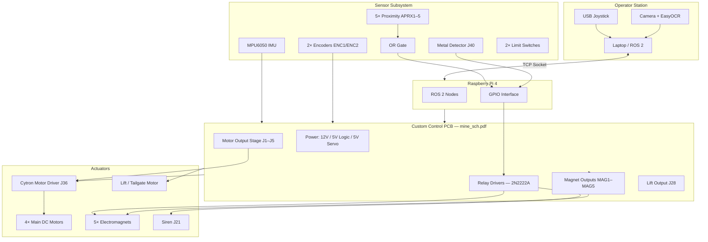

# Electronic Circuit & Control System Report
## Assiut Robotics Team — Minesweeper Robot

**Project:** Minesweeper Competition Robot  
**Team:** Assiut Robotics Team  
**Institution:** Assiut University — Faculty of Engineering  
**Supervisor:** Eng. Sayed Khader  
**Report sources:** `Assiut Robotics_Technical Report_2024.pdf`, `mine_sch.pdf`, `IMG-20260618-WA0007.jpg`, repository code & configs  
**Date:** June 19, 2026

---

## 1. Executive Summary

The Minesweeper robot is a competition-ready platform designed to scan a minefield, detect surface and buried mines, generate a live map, and remove surface mines. The **2024/2026 electronic design** is built around custom Assiut Robotics PCBs documented in `mine_sch.pdf`, with a **Raspberry Pi 4** running ROS 2 for high-level logic and a dedicated control board handling power distribution, sensing, motor driving, relays, and electromagnets.

| Layer | Hardware | Role |
|--------|----------|------|
| High-level | **Raspberry Pi 4** (ROS 2) | Teleoperation, mine mapping, vision/OCR, alert logic, GPIO sensor reads |
| Interface / power | **Custom Minesweeper PCB** (`mine_sch.pdf`) | Power rails, sensor headers, relay drivers, magnet/lift outputs, motor interface |
| Motion | **Cytron motor driver** + DC motors | Locomotion and tailgate/lift actuation |
| Sensing | MPU6050, encoders, proximity sensors, metal detector | Localization and mine classification |

**Operating modes:** Teleoperated (joystick) and Autonomous (ROS navigation + sensor-triggered mapping).

**Demo video:** [YouTube — Minesweeper Robot](https://youtu.be/dL5ubC7n4h4)

---

## 2. System Block Diagram



---

## 3. Physical Hardware — 3D PCB Assembly

Reference: `IMG-20260618-WA0007.jpg`

The electronic system is implemented as **three modular PCBs**:

### 3.1 Sensor / Interface Board (Top-Left)
- **5× white multi-pin connectors** — proximity sensor inputs (APRX1–APRX5)
- **5× blue indicator LED + resistor sets** — per-sensor status
- **1× large I/O connector** — main bus to control board
- **1× 2-pin screw terminal** — power or signal pass-through
- **Branding:** "ASSUIT ROBOTICS" silkscreen

### 3.2 Main Control / Power Board (Top-Right)
- **2× blue electromagnetic relays** (K1, K2) — magnet and siren switching
- **MPU6050 IMU module** on header (J29/J38)
- **USB Type-A port** (J7) — programming / data
- **Multiple green screw terminals** — 12 V and motor power distribution
- **2× tactile push buttons** — manual test / reset
- **4× electrolytic capacitors** — bulk power filtering
- **Assiut Robotics logo**

### 3.3 Motor / Actuator Driver Board (Bottom)
- **6× 2-pin screw terminals** (bottom row) — high-current motor/magnet outputs
- **4× corner screw terminals** — auxiliary power/signal
- **4× red status LEDs** — channel activity indication
- **2× large capacitors** — local 12 V filtering
- **Critical design note (silkscreen):** *"TO TURN THE MOTOR YOU MUST TURN ON THE MAGNETS"* — magnet enable is a prerequisite for motor actuation (interlock logic)

---

## 4. Electronic Circuits (from `mine_sch.pdf`)

### 4.1 Power Distribution

| Rail | Connector | Filtering | Loads |
|------|-----------|-----------|-------|
| **12 V** | J24 | 1000 µF (C5), 1000 µF (C7), 100 nF | Motors, relays, magnet bus |
| **12 V_MG** | — | 2000 µF (C3, C13), 100 nF (C4) | Electromagnet outputs MAG1–MAG5 |
| **5 V Logic** | J22 | 2000 µF (C9), 100 nF (C6) | IMU, encoders, logic, LEDs |
| **5 V Servo** | J23, J13 | 2000 µF (C11, C12), 100 nF (C8, C10) | Servo / auxiliary 5 V loads |

**Design intent:** Separate logic and high-current power rails with heavy bulk capacitance (>11,000 µF total) to absorb motor and magnet inrush without disturbing sensor logic.

---

### 4.2 Main Drive Motor Circuit

**Motors (2024 report):** 4× geared DC motors, ~70 RPM, high torque (~27 kg·cm; each motor rated ~18 kg load capacity)  
**Wheels:** 22 cm diameter × 10 cm width, off-road type with rubber friction layer  
**Driver:** Cytron motor driver module (connector **J36**)

**Motor output stage (schematic):**

| Output | Connector | Status LED | Notes |
|--------|-----------|------------|-------|
| OUT1 | J1 | DL1 | Motor channel 1 |
| OUT2 | J2 | DL2 | Motor channel 2 |
| OUT3 | J3 | DL3 | Motor channel 3 |
| OUT4 | J4 | DL4 | Motor channel 4 |
| OUT5 | J5 | DL5 | Motor channel 5 (lift/auxiliary) |

**Control signals (J44):** `DIR3`, `PWM3` + additional direction/PWM lines  
**Protection:** Per-channel status LEDs + 3.9 kΩ pull-down resistors; bulk capacitors on motor rail

**Arduino legacy pin map** (`PinConfig.txt` — pre-PCB reference):

| Signal | Arduino Pin | Function |
|--------|-------------|----------|
| FPWM1 / FPWM2 | 10 / 11 | Front motor PWM |
| FDIR1 / FDIR2 | 12 / 13 | Front motor direction |
| BPWM1 / BPWM2 | 6 / 9 | Rear motor PWM |
| BDIR1 / BDIR2 | 5 / 8 | Rear motor direction |

**Motor control API** (`Functions Discription.xlsx`):

| Function | Description |
|----------|-------------|
| `Forward(Speed)` | Forward with ramp-up |
| `Backward(Speed)` | Reverse with ramp-up |
| `RotateRight(Speed)` / `RotateLeft(Speed)` | Turning |
| `Stop()` | Gradual deceleration |
| `upSpeed()` / `downSpeed()` | Soft acceleration / deceleration |

---

### 4.3 Electromagnet & Lift Circuit

**Electromagnet outputs:**

| Output | Connector | Notes |
|--------|-----------|-------|
| MAG1 | J9 | Magnet coil 1 |
| MAG2 | J10 | Magnet coil 2 |
| MAG3 | J11 | Magnet coil 3 |
| MAG4 | J12 | Magnet coil 4 |
| MAG5 | J27 | Magnet coil 5 |

**Lift / tailgate:** `LIFT` on **J28** and **J37**  
**Auxiliary:** `SUB` on **J32**  
**Status LEDs:** DL6–DL9 on magnet/lift section  
**Power rail:** Dedicated `12V_MG` with 2000 µF × 2 bulk capacitors

**Relay-switched magnet bus:**

| Relay | Transistor | Diode | Switch Header | Load |
|-------|------------|-------|---------------|------|
| K1 | Q1 (2N2222A) | D1 (1N4007) | J19 — MAGNET SW | Magnet power enable |
| K2 | Q2 (2N2222A) | D2 (1N4007) | J18 — SIREN SW | Siren enable |

**Operation sequence (tailgate mechanism — 2024 report):**
1. Surface mine detected (proximity + metal detector logic)
2. Tailgate/lift lowers until limit switch triggers
3. **Magnet relay K1 enabled** → electromagnets engage
4. Lift motor raises tailgate; mine deposited in onboard storage box
5. Tailgate returns to home position

**Interlock:** PCB silkscreen requires magnets ON before motor actuation — prevents unloaded motor spin.

---

### 4.4 Mine Detection Circuit

#### A. Proximity Sensors (Surface Detection)
- **5× photoelectric proximity sensors** — downward-facing
- Individual inputs: **APRX1–APRX5** on connector **J39**
- Combined through **OR gate** → single digital line to Raspberry Pi GPIO
- Per-sensor blue LEDs on interface board for live diagnostics

#### B. Metal Detector (Buried Detection)
- Connector **J40 — METAL DETECTOR**
- Coil-based detector output → Raspberry Pi GPIO

**Raspberry Pi GPIO (software reference — `rasp_temp.py`):**

| Signal | BCM GPIO | Direction | Schematic Equivalent |
|--------|----------|-----------|---------------------|
| Proximity (OR output) | 17 | IN | APRX1–5 → OR → RPi |
| Metal detector coil | 22 | IN | J40 |
| Alert output (siren/flash) | 16 | OUT | J18 → K2 → J21 SIREN |

**Classification logic:**

| Metal Detector | Proximity | Result |
|----------------|-----------|--------|
| HIGH | HIGH | Surface mine → gripper activates |
| HIGH | LOW | Underground / buried mine |
| LOW | — | No mine |

> **Software note:** Coil classification logic is implemented in comments but currently disabled in `rasp_temp.py`; only proximity is active in the latest code.

---

### 4.5 Alert Circuit (Siren + Flash)

- Raspberry Pi GPIO 16 → relay driver Q2 (2N2222A) → **Relay K2** → **Siren J21**
- Controlled via switch header **J18 (SIREN SW)**
- Flyback protection: diode **D2 (1N4007)**
- Flash unit co-triggered with siren (2024 report, Figure 4)

---

### 4.6 Localization Sensor Circuit

| Sensor | Schematic Connector | Interface | Purpose |
|--------|---------------------|-----------|---------|
| **MPU6050 IMU** | J29 / J38 | I2C (SCL, SDA) + 5V Logic | Yaw / orientation correction |
| **Encoder 1** | J30 (ENC1) | A1, B1 quadrature | Wheel odometry |
| **Encoder 2** | J31 (ENC2) | A2, B2 quadrature | Wheel odometry |

**Fusion strategy (2024 report):** Encoder odometry fused with IMU (3-axis gyro + accelerometer) to reduce drift. Encoders mounted mid-frame; two encoders used for differential odometry.

**Microcontroller headers:** J39 (sensor + 12 V), J44 (DIR/PWM control) — interface to main MCU or Raspberry Pi GPIO expansion.

---

### 4.7 Logic Level & Signal Conditioning

| Component | Role |
|-----------|------|
| OR gate IC | Aggregate 5 proximity sensor outputs |
| Logic level converter | 3.3 V (RPi) ↔ 5 V (PCB logic) |
| 2N2222A + 1N4007 | Relay coil drive with flyback protection |
| 3.9 kΩ resistors | Pull-downs on motor/magnet control lines |
| Optoisolator/resistor networks (J35, J45) | Isolation on magnet/lift control section |

---

## 5. Mechanical & Environmental Design (2024 Report)

| Parameter | Specification |
|-----------|---------------|
| Frame material | High-density MDF (8 mm base + 4 mm cover sheets) |
| Gripper / detector | Acrylic |
| Wheels | 22 cm diameter, 10 cm width, off-road, rubber-coated |
| Motor torque | ~27 kg·cm per motor; ~18 kg load capacity each |
| Mine storage | Separate compartment isolated from electronics |
| Heat management | Ventilation holes, component spacing, cooling fans |
| Terrain | Designed for sand, gravel, grass, and rough surfaces |

---

## 6. Control System Architecture

### 6.1 Platform Overview

| Mode | Data Path |
|------|-----------|
| **Teleoperated** | Joystick → Laptop ROS 2 → TCP socket → Raspberry Pi → PCB → Cytron → motors |
| **Autonomous** | ROS navigation + camera/OCR grid localization + sensor-triggered map updates |
| **Simulation** | Gazebo URDF with ray-based proximity sensor plugin |

**Compute:** Raspberry Pi 4, ROS 2 (Humble workspace under `ROS Codes/`)

---

### 6.2 ROS 2 Node Architecture

| Node | Topic / Channel | Function |
|------|-----------------|----------|
| `joystick_publisher` | `joystick_direction` | Pygame joystick → direction strings |
| `joystick_subscriber` | `joystick_direction` | Receives drive commands |
| `mine_detection_publisher` | `mine_detection` | GPIO sensor polling (10 Hz) |
| `mine_detection_subscriber` | TCP :65436 | Receives detection status |
| `mine_mapping_publisher` | `mine_x`, `mine_y`, `mine_type` | Publishes mine coordinates |
| `mine_mapping_subscriber` | Same | Live 20×20 matplotlib grid map |
| `gripper_subscriber` | `gripper` | Tailgate / limit switch sequence |

**Direction commands:** `Forward`, `Backward`, `Left`, `Right`, `Forward-Left`, `Forward-Right`, `Backward-Left`, `Backward-Right`, `Stop`

---

### 6.3 Communication Interfaces

| Link | Protocol | Address | Port | Status |
|------|----------|---------|------|--------|
| Laptop → RPi (joystick) | TCP | `192.168.0.132` | 65432 | Implemented |
| RPi → Laptop (mine data) | TCP | `192.168.0.128` / `192.168.1.14` | 65433 | Implemented — IP needs standardization |
| Laptop mine subscriber | TCP server | Local | 65436 | Implemented |
| RPi ↔ Control PCB | GPIO / header J39, J44 | — | — | Wired per schematic |
| IMU / Encoders | I2C / GPIO via PCB | J29–J31 | — | Hardware ready; fusion code incomplete |

---

### 6.4 Control Flow — Teleoperation

```
USB Joystick
    ↓
Laptop: joystick_publisher (ROS 2 + pygame)
    ↓ TCP :65432
Raspberry Pi: direction handler
    ↓ GPIO / PCB headers
Cytron driver (J36) → 4× drive motors
```

---

### 6.5 Control Flow — Mine Detection & Mapping

```
APRX1–5 (OR gate) + Metal Detector J40
    ↓
Raspberry Pi GPIO 17, 22
    ↓ mine_detection_publisher (10 Hz)
ROS topic + TCP socket → mine_mapping_subscriber
    ↓
GPIO 16 → Relay K2 → Siren J21 + Flash
    ↓ (surface mine)
Relay K1 → MAG1–5 → Lift J28 → storage box
```

---

### 6.6 Vision Subsystem

- **Camera + EasyOCR** (`Vision Codes/EasyOCRextraction.py`)
- Reads arena grid labels (A–T columns, 1–20 rows) for position estimation
- Runs on laptop; integration with ROS navigation stack is planned

---

## 7. Complete Connector Reference (from `mine_sch.pdf`)

| Ref | Name | Function |
|-----|------|----------|
| J1–J5 | OUT1–OUT5 | Motor output channels |
| J6, J42 | — | Motor control inputs |
| J7 | USB | Programming / data |
| J9–J12, J27 | MAG1–MAG5 | Electromagnet outputs |
| J13 | SERVO | 5V servo rail |
| J18 | SIREN SW | Siren relay control |
| J19 | MAGNET SW | Magnet relay control |
| J21 | SIREN | Siren output |
| J22 | 5V Logic | Logic supply |
| J23 | 5V Servo | Servo supply |
| J24 | 12V | Main motor supply |
| J28 | LIFT | Lift / tailgate motor |
| J29/J38 | MPU6050 | IMU (SCL, SDA) |
| J30 | ENC1 | Encoder 1 (A1, B1) |
| J31 | ENC2 | Encoder 2 (A2, B2) |
| J32 | SUB | Auxiliary output |
| J36 | CYTRON | Cytron motor driver interface |
| J37 | LIFT | Lift control header |
| J39 | MCU/Sensor | APRX1–5, 12V, GND |
| J40 | METAL DETECTOR | Coil detector input |
| J44 | DIR3, PWM3 | Direction / PWM control |

---

## 8. Safety & Protection Features

| Feature | Implementation |
|---------|----------------|
| Motor inrush protection | Bulk capacitors + per-channel indicator LEDs |
| Relay flyback protection | 1N4007 diodes D1, D2 |
| Magnet–motor interlock | PCB silkscreen: magnets must be ON before motors |
| Fuse protection | Fuse + blown indicator (2024 report Figure 3) |
| Limit switches | Gripper/tailgate travel limits |
| Soft motor ramp | `upSpeed()` / `downSpeed()` in motor API |
| Alert on detection | Siren + flash via relay K2 |
| Thermal management | Ventilation, fans, wood frame, spaced mounting |
| Manual override | Joystick teleoperation + PCB test buttons |

---

## 9. Components Inventory

| Category | Component | Source |
|----------|-----------|--------|
| Compute | Raspberry Pi 4 | 2024 report |
| Custom PCB | 3-board set (sensor, control, motor) | `mine_sch.pdf`, 3D photo |
| Motor driver | Cytron module | Schematic J36 |
| Motors | 4× DC geared (~70 RPM, 27 kg·cm) | 2024 report |
| Lift motor | 1× (OUT5 / J28) | Schematic |
| IMU | MPU6050 | Schematic J29/J38 |
| Encoders | 2× rotary (ENC1, ENC2) | Schematic J30/J31 |
| Proximity | 5× photoelectric (APRX1–5) | Schematic + 2024 report |
| Metal detector | Coil module (J40) | Schematic |
| Magnets | 5× electromagnet (MAG1–5) | Schematic |
| Relays | 2× (K1 magnet, K2 siren) | Schematic |
| Transistors | 2× 2N2222A (Q1, Q2) | Schematic |
| Diodes | 2× 1N4007 (D1, D2) | Schematic |
| Power ICs | MP2307, MP2315 (buck) | Data sheets in repo |
| Alert | Siren + flash | Schematic J21 + 2024 report |
| Switches | 2× limit switches | 2024 report + code |

---

## 10. Remaining Gaps & Action Items

Items **resolved** since the initial draft:
- ✅ Schematic diagram — `mine_sch.pdf`
- ✅ PCB physical layout — `IMG-20260618-WA0007.jpg`
- ✅ Power rail architecture — 12V / 12V_MG / 5V Logic / 5V Servo
- ✅ Connector pinout — full J1–J44 table above
- ✅ IMU and encoder hardware integration — on PCB
- ✅ Demo video link — [YouTube](https://youtu.be/dL5ubC7n4h4)

Items **still missing or incomplete:**

| # | Item | Priority |
|---|------|----------|
| 1 | **Arduino / MCU firmware** (`.ino`) — not in repository | High |
| 2 | **RPi ↔ PCB serial/GPIO protocol** documented as code | High |
| 3 | **Encoder + IMU fusion code** — hardware ready, software incomplete | High |
| 4 | **GPIO 22 conflict** in Python (coil input vs gripper PWM) — reconcile with schematic J40 | High |
| 5 | **Inconsistent TCP IP addresses** in mine detection nodes | Medium |
| 6 | **Surface vs. buried classification** — disabled in code | Medium |
| 7 | **Battery specification** — type, voltage, Ah capacity not in schematic | Medium |
| 8 | **Gripper Python code** — skeleton only; magnet/lift relay control not implemented | Medium |
| 9 | **PCB layout files** (Gerber/KiCad) — only PDF schematic and photo available | Low |
| 10 | **Test measurements** — motor current, detection range, localization accuracy | Low |
| 11 | **`Components Sheet.xlsx`** — incomplete BOM | Low |
| 12 | **Camera model** — not specified | Low |

---

## 11. Recommendations

1. Align Python GPIO assignments with `mine_sch.pdf` connector map (resolve pin 22 conflict).
2. Implement magnet relay (K1 / J19) and siren relay (K2 / J18) control in ROS nodes.
3. Add firmware for encoder reading and MPU6050 fusion; publish `/odom` to ROS 2.
4. Re-enable dual-sensor mine classification (coil + proximity → Surface / Buried).
5. Document battery spec and complete the BOM in `Components Sheet.xlsx`.
6. Export KiCad/Gerber source files alongside `mine_sch.pdf` for manufacturing records.
7. Standardize all TCP socket IP addresses across nodes.

---

## 12. Conclusion

The Minesweeper robot's electronic and control system has matured from a conceptual dual-controller design to a **documented custom PCB implementation** (`mine_sch.pdf`) with three physical boards covering sensing, power/relay control, and motor/magnet actuation. The schematic confirms a robust power architecture (12 V motor/magnet rails, 5 V logic/servo rails), five proximity inputs with OR aggregation, MPU6050 + dual encoder localization, relay-driven siren/flash alerting, and five electromagnet outputs with a magnet-before-motor safety interlock.

The **2024 technical report** provides the competition context, mechanical specifications, and operational strategy. Combined with the new schematic and 3D PCB photo, the hardware design is now substantially documented. Remaining work is primarily **firmware integration**, **ROS node completion**, and **test data collection**.

---

## Appendix A — Reference Files

| File | Description |
|------|-------------|
| `Assiut Robotics_Technical Report_2024.pdf` | Competition technical report (2024) |
| `mine_sch.pdf` | Full system schematic |
| `IMG-20260618-WA0007.jpg` | 3D render of 3 PCB modules |
| `Project Folders/Config/PinConfig.txt` | Legacy Arduino motor pin map |
| `Project Folders/Functions Discription.xlsx` | Motor control function API |
| `Project Folders/Data Sheets/` | MP2307, MP2315, MPU-6000, ESP8266 |
| `ROS Codes/` | ROS 2 nodes (joystick, detection, mapping, gripper) |

## Appendix B — Figures

| Figure | Source | Content |
|--------|--------|---------|
| Figure 1 | 2024 report | Complete robot assembly |
| Figure 2 | 2024 report | Tailgate / electromagnet mine removal |
| Figure 3 | 2024 report | Motor protection circuit |
| Figure 4 | 2024 report | Siren and flash circuit |
| Figure 5 | 2024 report | Raspberry Pi pinout |
| Figure 6 | `mine_sch.pdf` | Full system schematic |
| Figure 7 | `IMG-20260618-WA0007.jpg` | 3D PCB module layout |
